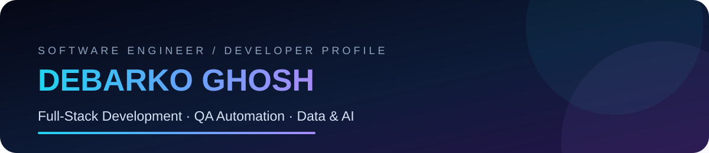
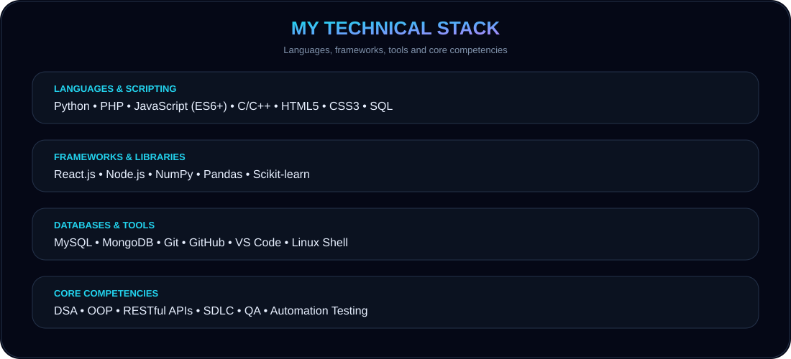
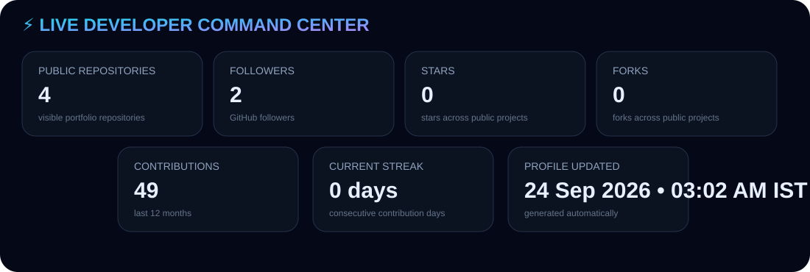
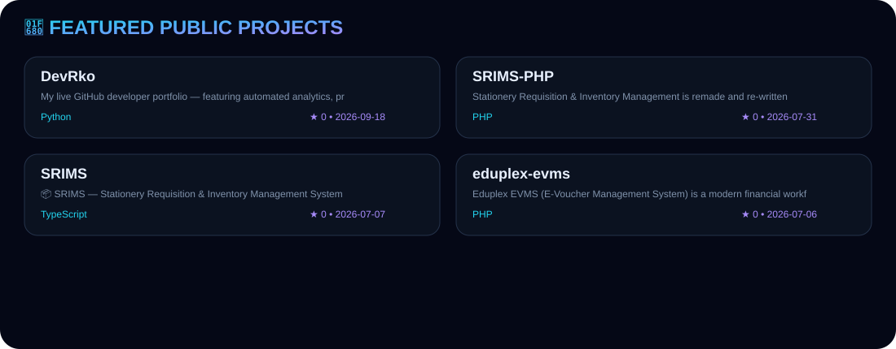
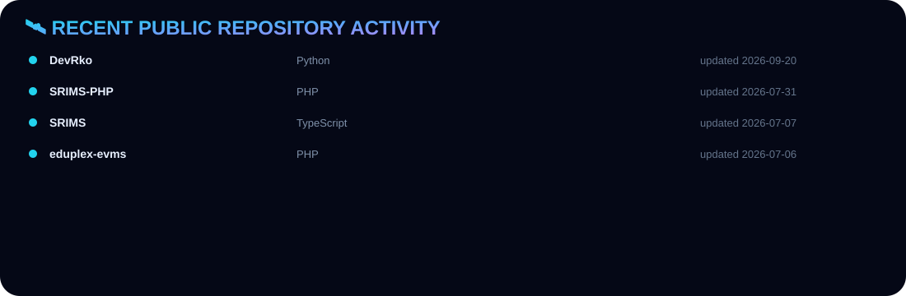
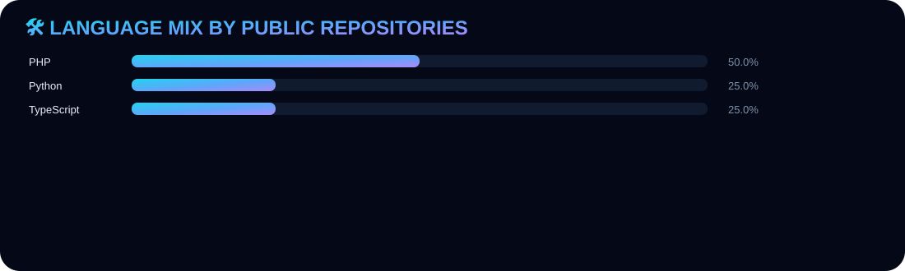

<div align="center">


# 👋 Hi, I'm Debarko Ghosh
### Software Engineer · Full-Stack Development · QA Automation · Data Management
**Building reliable applications, improving workflows, and working with data-driven systems.**

<a href="mailto:work.debarko@gmail.com"></a>
<a href="https://www.linkedin.com/in/debarko-ghosh/"></a>
<a href="https://github.com/devRko"></a>
</div>

---

## 👨‍💻 ABOUT ME
Detail-oriented Software Engineer with experience in full-stack development, QA automation, and data management. My work includes web applications, databases, Python-based data workflows, and practical machine-learning projects.

## 🧰 TECHNICAL STACK
<div align="center"></div>

## ⚡ LIVE GITHUB COMMAND CENTER
<div align="center"></div>

## 🚀 FEATURED PROJECTS
<div align="center"></div>

| Project | Focus |
|---|---|
| ✍️ **Handwritten Data Digitization Tool** | AI-powered Python application converting diverse handwritten note styles into structured Excel data |
| 🏫 **Reactive School Platform** | Responsive full-stack school administration platform using React.js and MySQL-backed workflows |
| 🗺️ **Geospatial Crime Data Analysis** | Predictive ML analysis of 10,000+ crime records with clustering and hotspot visualization |
| 👁️ **Real-Time Age & Gender Detection** | OpenCV and CNN-based live video classification |

## 🛰️ RECENT PUBLIC REPOSITORY ACTIVITY
<div align="center"></div>

## 📊 LANGUAGE MIX
<div align="center"></div>

## 🐍 CONTRIBUTION SNAKE
<div align="center">
<picture>
  <source media="(prefers-color-scheme: dark)" srcset="https://raw.githubusercontent.com/devRko/devRko/output/github-contribution-grid-snake-dark.svg" />
  <source media="(prefers-color-scheme: light)" srcset="https://raw.githubusercontent.com/devRko/devRko/output/github-contribution-grid-snake.svg" />
  
</picture>
</div>

## 🧠 WHAT I WORK WITH
| Area | Technologies |
|---|---|
| 💻 Languages & Scripting | Python, PHP, JavaScript (ES6+), C/C++, HTML5, CSS3, SQL |
| ⚛️ Frameworks & Libraries | React.js, Node.js, NumPy, Pandas, Scikit-learn |
| 🗄️ Databases & Tools | MySQL, MongoDB, Git, GitHub, VS Code, Linux Shell |
| 🧪 Core Competencies | Data Structures & Algorithms, OOP, RESTful APIs, SDLC, QA, Automation Testing |

## 🧭 HOW THIS PROFILE STAYS LIVE
```text
GitHub REST API + GraphQL
        ↓
Python Profile Generator
        ↓
Custom SVG / JSON Assets
        ↓
GitHub Actions
        ↓
Auto-updated GitHub Profile
```

**BUILD · TEST · AUTOMATE · IMPROVE**
